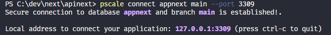

# Testing project focused in Next Api Routes

> The idea behind this project is to use a frontend project to make the services connections, like database and others, it makes the backend role.
> It uses prisma and planetscale to manage the database.

> On runtime i've used proxies for the planetscale database with planet scale CLI.
> Don't forget the connections on environment variables, something like this:

```
DATABASE_URL="mysql://root@localhost:3309/appnext"
SHADOW_DATABASE_URL="mysql://root@localhost:3310/appnext"
```

> after using pscale auth login command
> you need to run pscale connect (your-database-project) (yourdatabase-branch) --port (port-defined-in-env-vars)
> like this:

